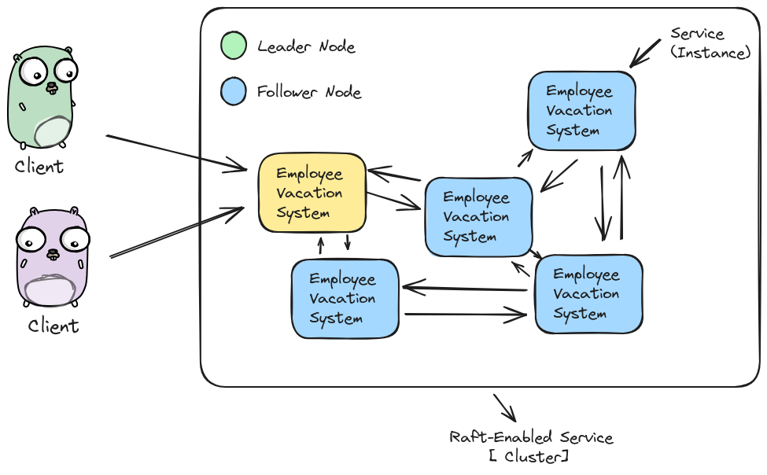
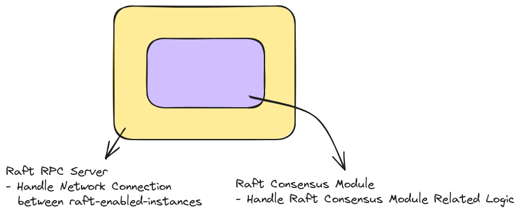

# raft
my implementation of the distributed consensus algorithm (Raft) in Go

# How Raft works to support your replicated state machine design 

# What are we building, and when we can use it ?
We are simply building an algorithm to achieve consensus between multiple replicas of the same system.

# When to use Raft ?
- Raft is not designed for highly throughput systems, because basically raft is a strong-leader algorithm.
- use raft for `Replicating configs for a distributed system cluster` for example, but don't use it for a `database implementation`, because it will be really slow when the load increase`.

# Code Architecture 
### High Level Architecture : 

#### How I've choosed the randomied election timeout ?
- Simply, from Raft paper : 
> Raft uses randomized election timeouts to ensure that
split votes are rare and that they are resolved quickly. To
prevent split votes in the first place, election timeouts are
chosen randomly from a fixed interval (e.g., 150–300ms).